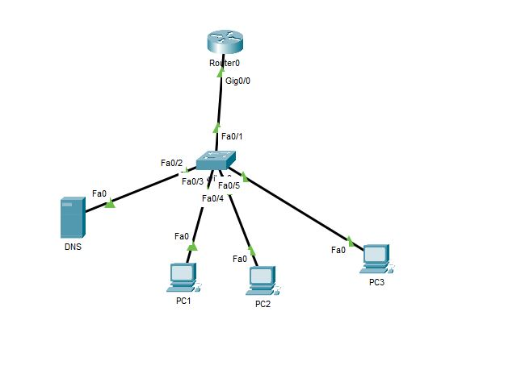
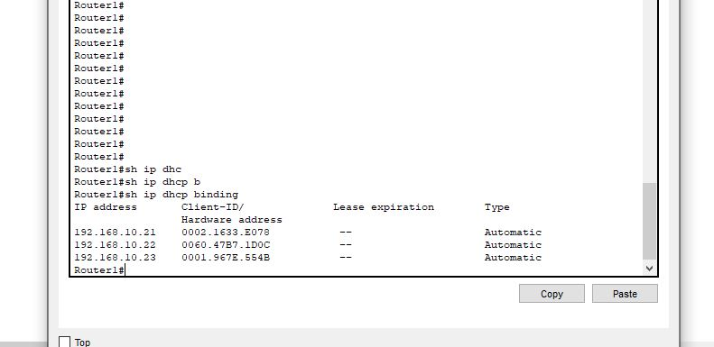
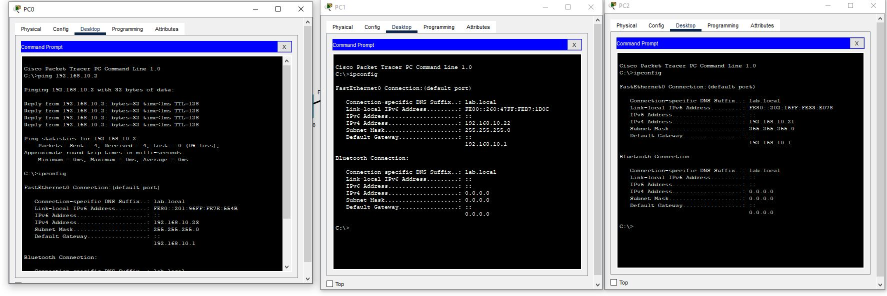

# 🖧 TP - Administration Réseau

## 📌 Objectifs du TP

Mise en place d'un DHCP sans options sur du matériel Cisco pour un seul LAN

## 🛠️ Environnement technique

- **Outils** : Packet tracer

❗ Dû à des limites de packet tracer, des options comme la durée du lease ne peut pas être saisie.

## 🗂️ Modules détaillés

|📁 Module|Description|
|:-:|:-:|
|Configuration initial|adressage IP et renommage du matériel|
|Configuration DHCP|Mise en place du DHCP|
|Test de la configuration|Contrôle de la configuration|

🗺️  Topologie



## 📜 Etapes mise en place de la solution

### Configuration initial

Configuration initial du routeur qui consiste en:

- Renommage périphérique
- Adressage IP

```bash
en
conf t
hostname Router1
interface gigabit 0/0
ip address 192.168.10.1 255.255.255.0
end
wr
```

### Configuration DHCP

Mise en place de la configuration DHCP pour le LAN10 :

```bash
ip dhcp pool LAN10
network 192.168.10.0 255.255.255.0
default-router 192.168.10.1
dns-server 8.8.8.8
exit
ip dhcp excluded-address 192.168.10.1 192.168.10.20
end
wr
```

### Test de la configuration

Avec la commande `show ip dhcp binding`, liste des adresses attribué



Avec un `ipconfig`, chaque PC à bien une adresse correspondant au DHCP



## 🧠 Ce que j’ai appris

- Mise en place d'un DHCP pour un lan unique
- Vérification des baux attribué
