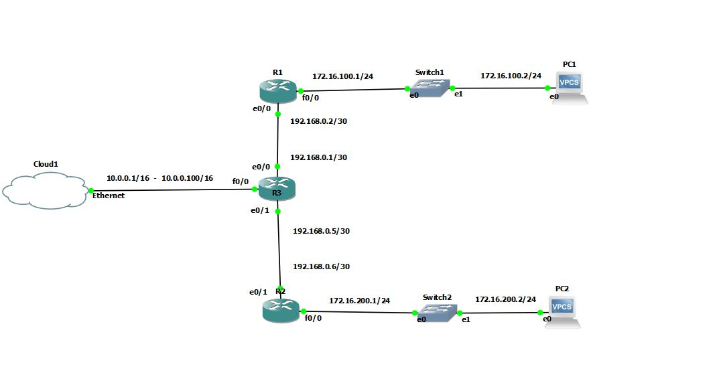
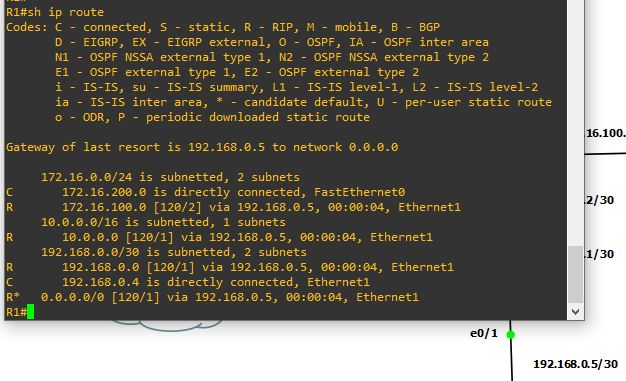
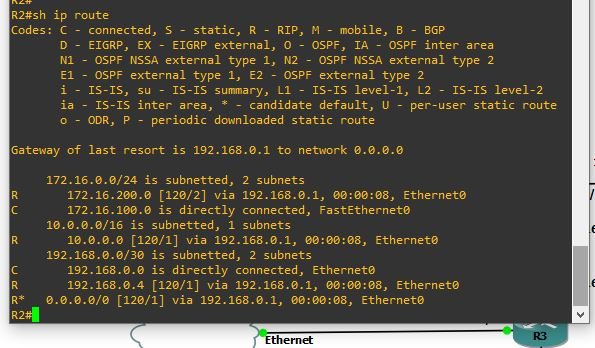
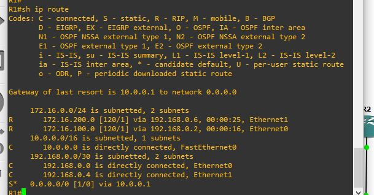
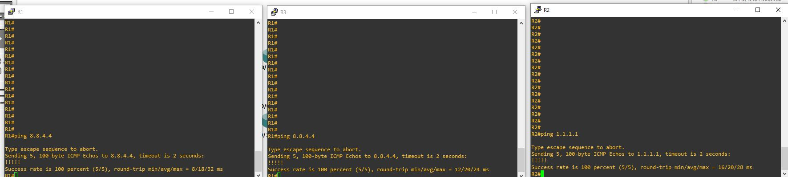
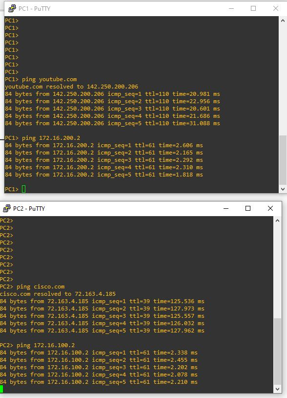

# 🖧 TP personnel - Administration Réseau

## 📌 Objectifs du TP

Mise en place d'un routage dynamique RIP version 2 avec passerelle par défaut, redistribuer par le protocole RIP.

## 🛠️ Environnement technique

- **Outils** : GNS3, image routeur Cisco C1700

## 🗂️ Modules détaillés

|📁 Module|Description|
|:-:|:-:|
|Configuration initiale|Configuration de l'adressage ip, nom appareil|
|Configuration RIP|Définition du processus RIP avec configuration|
|Mise en place NAT|Création d'un NAT pour permettre une connexion sortante|
|Test & contrôle|Test unitaire et contrôle de configuration|

## Topologie



## 📸 Etapes mise en place de la solution

### Configuration initiale

Configuration initiale des différents routeurs, en accord avec la topologie.

Les switchs n'ont aucune configuration

R3

```bash
en
conf t
hostname R3
interface fastethernet 0
ip address 10.0.0.100 255.255.0.0
no shutdown
exit
interface ethernet 0
ip address 192.168.0.1 255.255.255.252
no shutdown
exit
interface fastethernet 1
ip address 192.168.0.5 255.255.255.252
no shutdown
end
wr
```

R1

```bash
en
conf t
hostname R1
interface ethernet 0
ip address 192.168.0.2 255.255.255.252
no shutdown
exit
interface fastethernet 0
ip address 172.16.100.1 255.255.255.0
no shutdown
end
wr
```

R2

```bash
en
conf t
hostname R2
interface ethernet 1
ip address 192.168.0.6 255.255.255.252
no shutdown
exit
interface fastethernet 0
ip address 172.16.200.1 255.255.255.0
no shutdown
end
wr
```

### Configuration RIP

R1

```bash
router rip
version 2
no auto-summary
network 172.16.100.0
network 192.168.0.0
passive-interface fastethernet 0
end
wr
```

R2

```bash
router rip
version 2
no auto-summary
network 172.16.200.0
network 192.168.0.4
passive-interface fastethernet 0
end
wr
```

R3

```bash
router rip
version 2
no auto-summary
network 10.0.0.0
network 192.168.0.0
network 192.168.0.4
default-information originate
passive-interface fastethernet 0
exit
ip route 0.0.0.0 0.0.0.0 10.0.0.1
exit
wr
```

### Mise en place NAT

Sur le routeur R3 qui fait office de NAT

```bash
conf t
interface fastethernet 0
ip nat outside
exit
interface ethernet 0
ip nat inside
exit
interface ethernet 1
ip nat inside
exit
ip access-list standard 1
permit 192.168.0.0 0.0.0.3
permit 192.168.0.4 0.0.0.3
permit 172.16.100.0 0.0.0.255
permit 172.16.200.0 0.0.0.255
ip nat inside source-list 1 interface fastethernet 0 overload
end
wr
```

### Test & contrôle

### Contrôle et test des routeurs

table de routage des routeurs

On peut voir les routes appris par RIP ainsi que la route statique par défaut retransmit par RIP

R1

R2

R3


Test de ping de l'adresse 8.8.8.8 depuis chaque routeur



### Contrôle et test depuis les PC

Test de ping de nom de domaine depuis chaque PC

Les PC peuvent ping un nom de domaine mais peuvent aussi se ping entre eux alors que, sur des réseaux différents connus par le biais de RIP



## 🧠 Ce que j’ai appris

- Configuration du protocol RIP
- Comment définir et redistribuer une route statique
- L'utilisation d'un NAT avec un routage dynamique
