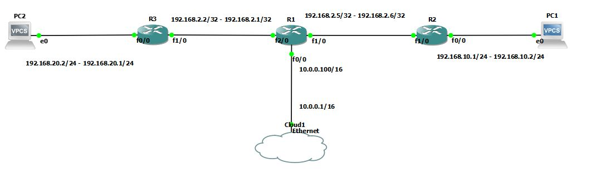
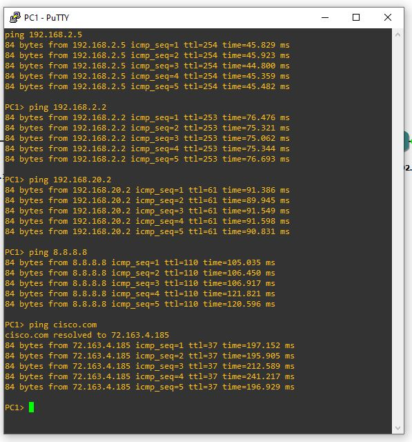
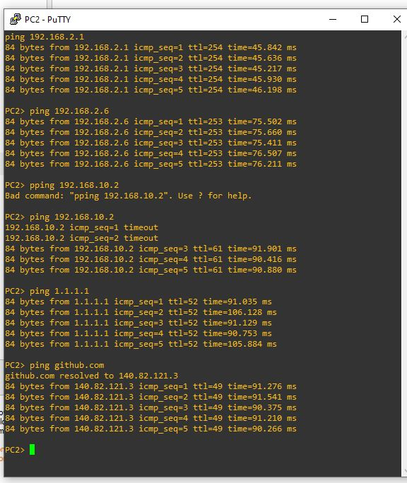

# 🖧 Lab personnel - Administration Système & Réseau

## 📌 Objectifs du lab

- Mise en place de routage statique
- Mise en place d'une route par défaut

## 🛠️ Environnement technique

- **Outils** : GNS3 avec image Cisco

## 🗂️ Modules détaillés

|📁 Module|Description|
|:-:|:-:|
|Configuration initiale|Adressage IP, nommage des équipements|
|Routage statique|Configuration des routes entre les équipements|
|Route par défaut|Implémentation d'une route de secours vers un réseau inconnu ou vers Internet.|
|Tests|Test et diagnostic pour valider la configuration|

### 🗺️  Topologie



## 📜 Etapes mise en place de la solution

### 1ère Partie - Adressage IP

Configuration de l'adressage IP des routeurs et changement de leurs nom

#### *Adressage IP Routeur1*

```bash
en
conf t
hostname Routeur1
int fa0/0
ip address 10.0.0.100 255.255.0.0
no shutdown
description Link to WAN
exit
interface fa 1/0
ip address 192.168.2.5 255.255.255.252
no shutdown
description Link to LAN10
exit
interface fa 2/0
ip address 192.168.2.1 255.255.255.252
no shutdown
description Link to LAN20
end
wr
```

 ***

#### *Adressage IP Routeur 2*

```bash
en
conf t
hostname Routeur2
interface fastethernet 1/0
ip address 192.168.2.6 255.255.255.252
no shutdown
description LINK Routeur1 - Routeur2
exit
interface fastethernet 0/0
ip address 192.168.10.1 255.255.255.0
no shutdown
description LAN10
end
wr
```

***

#### *Adressage IP Routeur3*

```bash
en
conf t
hostname Routeur3
interface fastethernet 1/0
ip address 192.168.2.2 255.255.255.252
no shutdown
description LINK Routeur1 - Routeur3
exit
interface fastethernet 0/0
ip address 192.168.20.1 255.255.255.0
no shutdown
description LAN20
end
wr
```

***

### 2ème Partie - Routage statique

Mise en place des routes statiques pour que chaque sous réseaux puissent communiquer entre eux.

Le réseaux 10.0.0.0/16 sera configuré plus tard par le biais de route par défaut

#### *Routage statique Routeur1*

```bash
ip route 192.168.10.0 255.255.255.0 192.168.2.6
ip route 192.168.20.0 255.255.255.0 192.168.2.2
```

***

#### *Routage statique Routeur2*

```bash
ip route 192.168.2.0 255.255.255.252 192.168.2.5
ip route 192.168.20.0 255.255.255.0 192.168.2.5
```

***

#### *Routage statique Routeur3*

```bash
ip route 192.168.2.4 255.255.255.252 192.168.2.1
ip route 192.168.10.0 255.255.255.0 192.168.2.1
```

***

### 3ème Partie - Route par défaut

Mise en place des routes par défaut et ajout d'un NAT overload sur le routeur1 qui fait la connexion entre le réseau WAN et le réseau LAN

#### *Route par défaut Routeur 1*

```bash
ip route 0.0.0.0 0.0.0.0 10.0.0.1
```

***

#### *Route par défaut Routeur 2*

```bash
ip route 0.0.0.0 0.0.0.0 192.168.2.5
```

***

#### *Route par défaut Routeur 3*

```bash
ip route 0.0.0.0 0.0.0.0 192.168.2.1
```

***

#### *ajout du NAT sur le routeur 1*

```bash
acces-list 1 permit 192.168.10.0 0.0.0.255
acces-list 1 permit 192.168.20.0 0.0.0.255
ip nat source list 1 interface fastethernet 0/0 overload
interface fastethernet 0/0
ip nat outside
exit
interface fastethernet 2/0
ip nat inside
exit
interface fastethernet 1/0
ip nat inside
exit
end
wr
```

### Test

Une fois des adresses IP affectés aux ordinateurs:

Test de ping depuis PC1 vers les destinations:

- 192.168.2.5
- 192.168.2.2
- 192.168.20.2
- 8.8.8.8
- cisco.com



Test de ping depuis PC2 vers les destinations:

- 192.168.2.1
- 192.168.2.6
- 192.168.10.2
- 1.1.1.1
- github.com



## 🧠 Ce que j’ai appris

- Mise en place de routes statique pour permettre à des réseaux non connecté entre eux de pouvoir communiquer
- Mise en place d'une route par défaut pour, dans le cas où une requète doit atteindre un réseau inconnu, les requètes sont routé vers l'extérieur du réseau.
