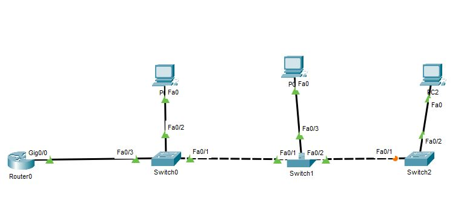
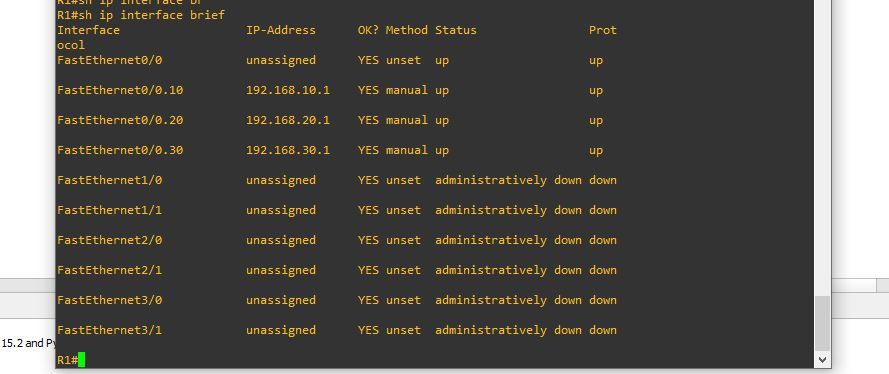
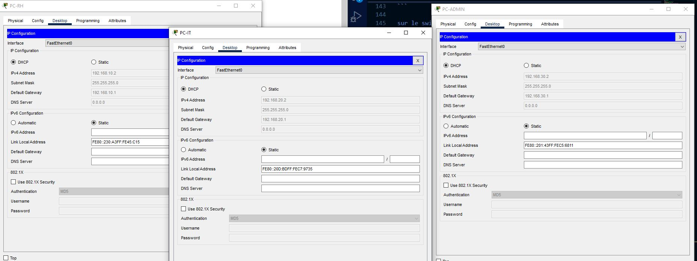
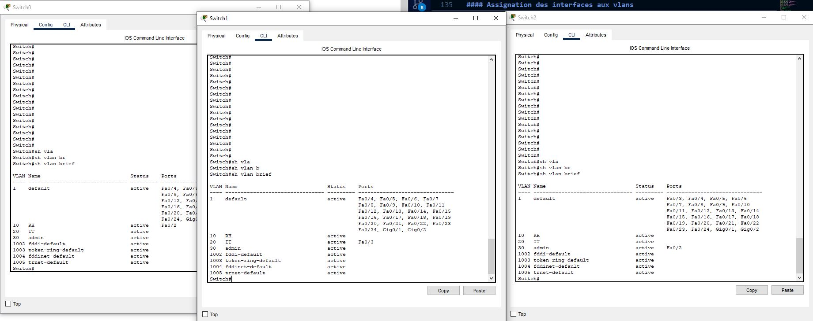

# 🖧 TP personnel - Administration Réseau

## 📌 Objectifs du TP

Mise en place du protocole VTP

## 🛠️ Environnement technique

- **Outils** : Cisco Packet Tracer

## 🗂️ Modules détaillés

|📁 Module|Description|
|:-:|:-:|
|Configuration switchport|Configuration des switchport pour les interfaces|
|Configuration VTP|Mise en place et configuration du protocole VTP|
|Création VLAN|Création des VLAN et assignation des interfaces aux VLANs|
|Test/contrôle|Test et contrôle du protocole VTP|

## Topologie



## 📸 Etapes mise en place de la solution

### Préparation Pré-configuration

Avant de configurer les switchs, j'ai créer des DHCP sur le routeur et mis en place des sous-interfaces pour chaque vlans

```bash
en
conf t
ip dhch pool lan10
network 192.168.10.0 255.255.255.0
default-router 192.168.10.1
exit
ip dhch pool lan20
network 192.168.20.0 255.255.255.0
default-router 192.168.20.1
exit
ip dhch pool lan30
network 192.168.30.0 255.255.255.0
default-router 192.168.30.1
exit
interface gigabit 0/0
no ip address
no shutdown
exit
interface gigabit 0/0.10
encapsulation dot1q 10
ip address 192.168.10.1 255.255.255.0
interface fa0/0.20
encapsulation dot1q 20
ip address 192.168.20.1 255.255.255.0
interface fa0/0.30
encapsulation dot1q 30
ip address 192.168.30.1 255.255.255.0
end
wr
```

Capture d'écran permettant de contrôller la configuration des sous-interfaces



***

### Configuration switchport

Sur chaque switchs, configuration du mode trunk pour les interfaces reliant chaque switch ainsi que, le switch faisant liaison avec le routeur

Switch 0

```bash
en
conf t
interface fastEthernet 0/1
switchport nonegociate
switchport mode trunk
switchport trunk allow vlan 10,20,30
interface fastEthernet 0/3
switchport nonegociate
switchport mode trunk
switchport trunk allow vlan 10,20,30
end
```

Switch 1

```bash
en
conf t
interface range ethernet 1-2
switchport nonegociate
switchport mode trunk
switchport trunk allow vlan 10,20,30
end
```

Switch 2

```bash
en
conf t
interface ethernet 2
switchport nonegociate
switchport mode trunk
switchport trunk allow vlan 10,20,30
end
```

***

### Configuration VTP

***

#### ⚠️ Mise en garde

Avant d'ajouter un appareil prenant en charge VTP sur une infrastructure, il est très important de vérifier que le serveur VTP ne possède pas déja une configuration VTP.

Dans le cas ou une configuration VTP est déja existante, si le numéro de `configuration release` est supérieur à celui du serveur VTP, la configuration du serveur VTP sera écrasée

Un client VTP peut remplacer un serveur VTP, si le numéro de révision est supérieur… Parce qu'un serveur VTP est également un client VTP.

#### configuration VTP Server

Configuration du switch qui fera office de serveur VTP

La commande prunning permet, sur chaque switch de vérifier si la trame entrante possède un tag vlan correspondant à un vlan utilisé sur ce switch, dans le cas contraire, la trame est supprimé.

La commande n'est pas disponible sur Cisco packet tracer

```bash
vtp domain lab.local
vtp version 2
vtp mode serveur
vtp password test
vtp prunning
```

#### configuration VTP Client

sur les switch qui feront office de client VTP

```bash
vtp domain lab.local
vtp version 2
vtp mode client
vtp password test
```

#### Création VLAN

Création des vlans sur le switch en mode VTP server

Les vlans crée sont stocké dans un fichier dans `flash: vlan.dat`

```bash
conf t
vlan 10
name RH
vlan 20
name IT
vlan 30
name admin
```

#### Assignation des interfaces aux vlans

Pour chaque switch, j'assigne une interface à un numéro de vlan

sur le switch0

```bash
interface fa0/2
switchport mode access
switchport access vlan 10
```

sur le switch1

```bash
interface fa0/3
switchport mode access
switchport access vlan 20
```

sur le switch2

```bash
interface fa0/2
switchport mode access
switchport access vlan 30
```

### Test et contrôle

Capture d'écran des 3 PC avec une adresse IP pris en DHCP



Vlan database des switch pour vérifier si, les vlans sont bien transmis par VTP



## 🧠 Ce que j’ai appris

- Automatisation de déploiements système
- Analyse de paquets réseau
- Gestion d’accès et sécurité système
- Supervision d'une architecture réseau complète
