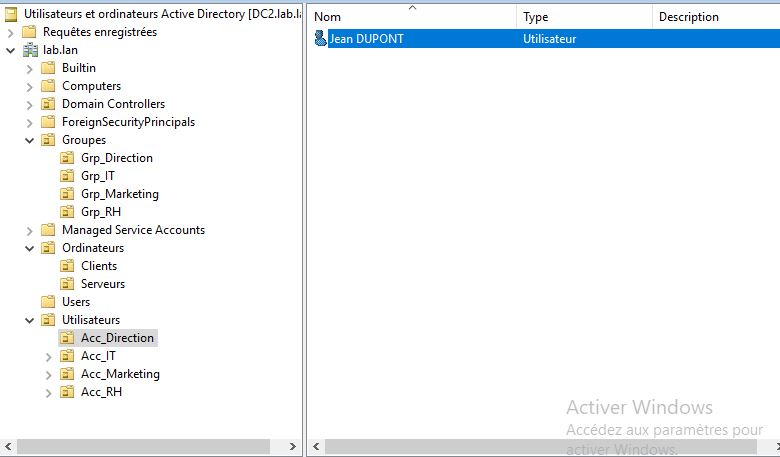

# 💻 TP personnel - Administration Système & Réseau

## 📌 Objectifs du TP

Création des unitées d'organisation pour segmenter par type de ressource et dans le futur, faciliter la gestion et l'application de GPO

- Création OU
- Gestion objet active directory
- Ajout d'utilisateur dans l'OU correspodant

## 🛠️ Environnement technique

- **OS** : Windows Server 2019
- **Hyperviseur** : Hyper-V

1 serveur en CLI pour la création des ressources, 1 serveur en GUI pour contrôler la création.

## 🗂️ Modules détaillés

|Module|Description|
|:-:|:-:|
|Création OU|Création des unitées d'organisation|
|Gestion Object AD|Déplacer les ressources existantes dans la bonne OU|
|Ajout utilisateur|Ajout d'utilisateur dans l'OU respective|

## 📸 Etapes mise en place de la solution

### Création OU

Schéma d'organisation des OU

```c
|Groupes
|---Direction
|---Marketing
|---IT
|---RH
|Ordinateurs
|---Clients
|---Serveurs
|Utilisateurs
|---Direction
|---Marketing
|---IT
|---RH
```

Dans un premier temps, je vais créer la racine de chaque OU

```powershell
New-AdNewOrganizationalUnit -Displayname "Groupes" -Name "Groupes" -Description "OU pour gestion groupes"
```

***

```powershell
New-AdNewOrganizationalUnit -Displayname "Ordinateurs" -Name "Ordinateurs" -Description "OU pour gestion ordinateurs"
```

***

```powershell
New-AdNewOrganizationalUnit -Displayname "Utilisateurs" -Name "Utilisateurs" -Description "OU pour gestion utilisateurs"
```

***

Ici, je ne spécifie pas de chemin avec le paramètre `-path`, pour que les OU soit créer directement à la racine de la console `Utilisateurs et ordinateurs Active Directory`

J'ajoute ensuite, pour chaque OU, ses "Sous-OU"

#### OU Groupes

***

```powershell
New-AdNewOrganizationalUnit -Displayname "Grp_Direction" -Name "Grp_Direction" -Description "Ou gestion Grp_Direction" -path "OU=GroupesDC=labDC=lan"
```

***

```powershell
New-AdNewOrganizationalUnit -Displayname "Grp_IT" -Name "Grp_IT" -Description "Ou gestion Grp_IT" -path "OU=Groupes,DC=lab,DC=lan"
```

***

```powershell
New-AdNewOrganizationalUnit -Displayname "Grp_Marketing" -Name "Grp_Marketing" -Description "Ou gestion Grp_Marketing" -path "OU=Groupes,DC=lab,DC=lan"
```

***

```powershell
New-AdNewOrganizationalUnit -Displayname "Grp_RH" -Name "Grp_RH" -Description "Ou gestion Grp_RH" -path "OU=Groupes,DC=lab,DC=lan"
```

***

#### OU Ordinateurs

```powershell
New-AdNewOrganizationalUnit -Displayname "Clients" -Name "Clients" -Description "Ou gestion PC clients" -path "OU=Ordinateurs,DC=lab,DC=lan"
```

***

```powershell
New-AdNewOrganizationalUnit -Displayname "Serveurs" -Name "Serveurs" -Description "Ou gestion Serveurs" -path "OU=Ordinateurs,DC=lab,DC=lan"
```

#### OU Utilisateurs

```powershell
New-AdNewOrganizationalUnit -Displayname "Acc_Direction" -Name "Acc_Direction" -Description "Ou gestion utilisateurs direction" -path "OU=utilisateurs,DC=lab,DClan"
```

***

```powershell
New-AdNewOrganizationalUnit -Displayname "Acc_IT" -Name "Acc_IT" -Description "Ou gestion utilisateurs IT" -path "OU=utilisateurs,DC=lab,DClan"
```

***

```powershell
New-AdNewOrganizationalUnit -Displayname "Acc_Marketing" -Name "Acc_Marketing" -Description "Ou gestion utilisaturs marketing" -path "OU=utilisateurs,DC=lab,DClan"
```

***

```powershell
New-AdNewOrganizationalUnit -Displayname "Acc_RH" -Name "Acc_RH" -Description "Ou gestion utilisateurs RH" -path "OU=utilisateurs,DC=lab,DClan"
```

### Gestion objet AD

Maintenant, je dois déplacer les ordinateurs déja existant vers leur OU respectives

A ce niveau la, j'avais dans l'OU `Computers` 2 machines

- CLI1
- FILE

```powershell
move-AdObject -Identity "CN=CLI1,CN=Computers,DC=lab,DC=lan" -TargetPath "OU=Clients,OU=Computers,DC=lab,DC=lan"
```

***

```powershell
move-AdObject -Identity "CN=FILE,CN=Computers,DC=lab,DC=lan" -TargetPath "OU=Serveurs,OU=Ordinateurs,DC=lab,DC=lan"
```

### Ajout utilisateur

A répéter pour tout autres utilisateurs pour chaque OU

Le plus simple serait de, générer les utilisateurs via un script qui lit un fichier CSV

```powershell
New-ADUser -Name "Jean DUPONT" -GivenName "Jean" -Surname "DUPONT" -SamAccountName "jdupont" -UserPrincipalName "jdupont" -Enabled $true -ChangePasswordAtLogon $true -AccountPassword (ConvertTo-SecureString "P@ssw0rd" -AsPlainText -Force) -Path "OU=Acc_Direction,OU=Utilisateurs,DC=lab,DC=lan"
```

Pour finir, une capture d'écran pour contrôler que tout est bien créer et visible


