# 💻 Lab personnel - Administration Système

## 📌 Objectifs du lab

L'objectif de ce lab, est la mise en place d'un domaine active directory à partir d'un windows server en mode core, en powershell pour pousser la compréhension de: Qu'est ce qui se passe d'un point de vue système, de manière approfondi, lorsque la tâche est faite de manière graphique

L'intéret est de transposer l'interaction graphique vers une interaction texte.

2 windows serveur seront utilisé:

- 1 en mode core où, la majorité du travail sera effectué
- 1 en mode graphique pour contrôler que tout est bien mis en place

## 🛠️ Environnement technique

- **OS** : windows Server 2019
- **Hyperviseur** : Hyper-V avec un VLAN isolé

## 🗂️ Modules détaillé

|📁 Module|Description|
|:-:|:-|
|Adressage IP|Adressage IP et configuration DNS|
|Installation|Installation de rôle ADDS|
|Création|Création d'une fôret et d'un domaine active directory|
|Contrôle|Vérifier que le domaine soit bien installé et connexion en tant que admin du domaine|

## 📸 Etapes mise en place de la solution

Une fois le windows serveur core installé, il est nécessaire de modifier le mot de passe administrateur qui à ce moment la est vide

Lors de la promotion du serveur en contrôleur de domaine, le compte administrateur ne peut pas être vide sous quoi, un message d'erreur donnera un avertissement

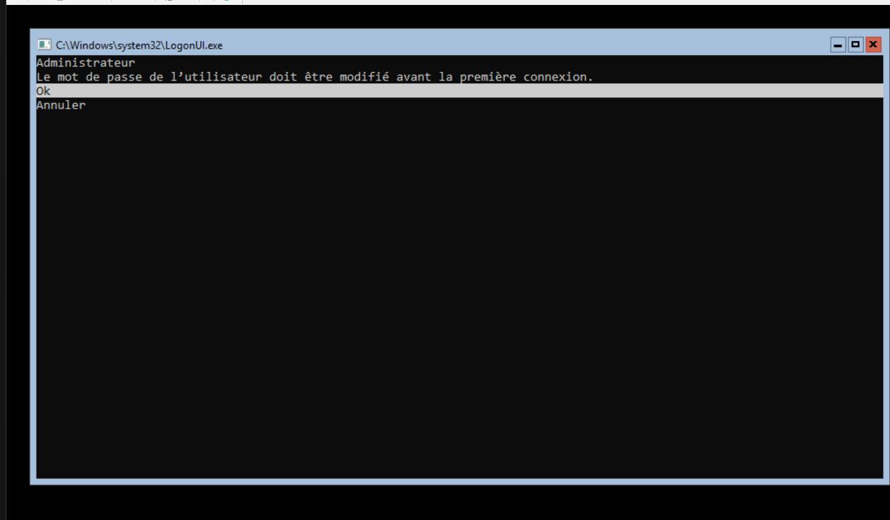

Une bonne pratique, qui reste basique, sera de renommer le serveur avec un nomm communicatif sur son rôle

Je le renomme `DC1`, vu que ce sera mon contrôleur de domaine principal

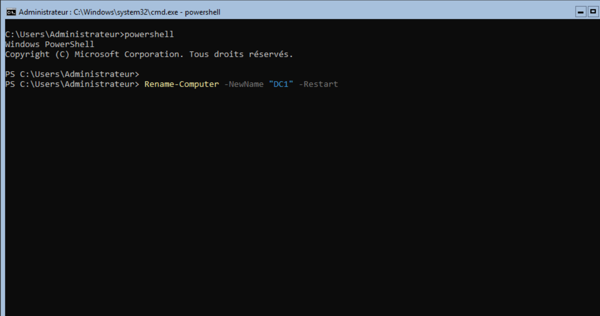

Dans un premier temps, avant de faire l'adressage IP, il est nécessaire de savoir sur quel interface on veut agir

Ici, je sais que mon interface à pour n° d'index 6

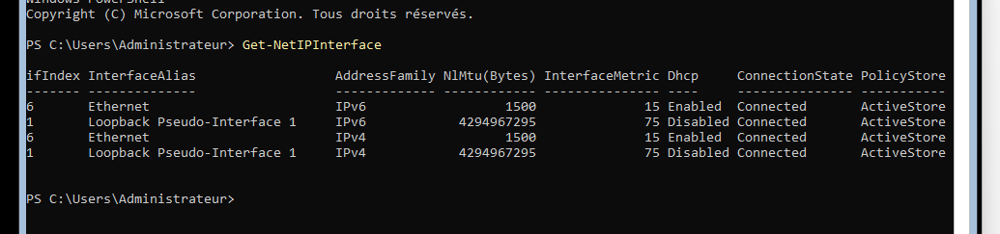

Ensuite, faire l'adressage IP du serveur pour le mettre en statique

La configuration du DNS se fait dans une étape séparé de l'adressage IP

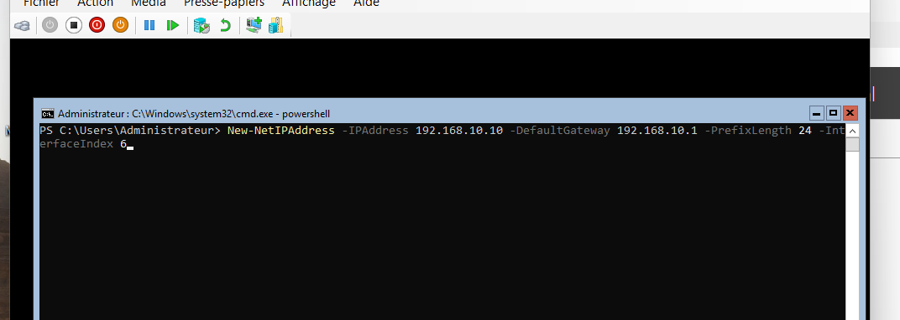

Suivi de la définition du ou des serveurs DNS

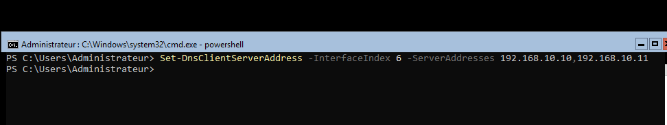

Avant d'installer le rôle ADDS, je vais chercher le nom du rôle à installer avec la commande

```powershell
get-windowsfeatures -name *ad*
```

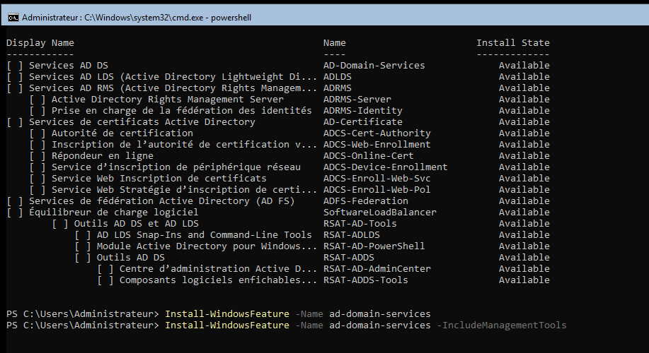

Maintenant, je sais que je dois installer le rôle `ad-domain-services`.

J'inclus avec, les outils de gestion `-IncludeManagementTools`

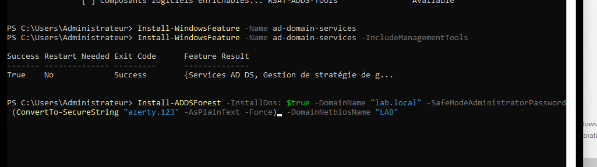

Le processus d'installation doit démarrer, avec un peu de patience et un redémarrage, il est demandé le mot de passe pour se connecter au compte administrateur du domaine

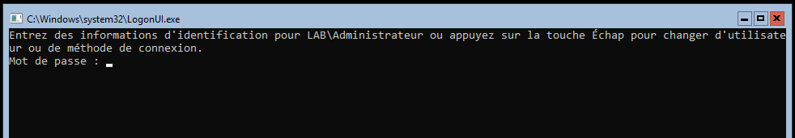

Sur le deuxième serveur, on renomme le serveur avec un nom plus parlant ainsi que, lui affecter une adresse IP en statique et le rôle ADDS installer

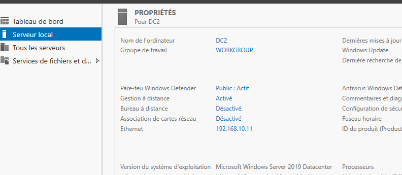

J'ai choisis ici, de joindre ce contrôleur de domaine, au domaine en powershell pour la simple raison de :

> Si je sais crée une forêt et un domaine en powershell, pourquoi devrais-je éviter de savoir comment joindre une machine au domaine?

Des logs seront demandés ( qui sont bien évidemment, les logs de l'administrateur du domaine )

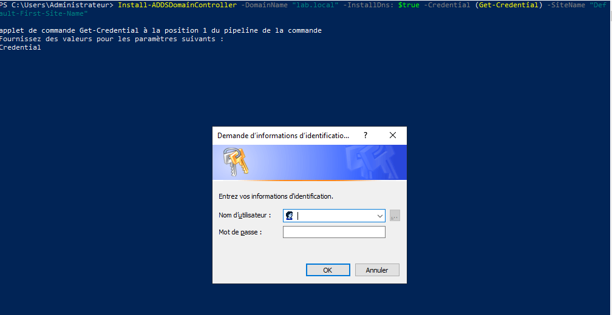

Une fois le serveur redémarré, on peut voir que je peux me connecter au domaine en tant que, administrateur du domaine

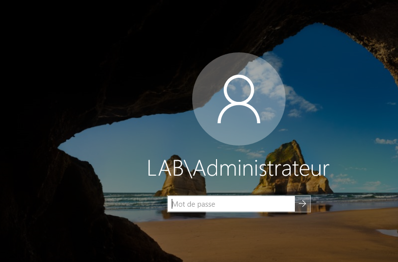

## 🧠 Ce que j’ai appris
