# 💻 TP personnel - Administration Système

## 📌 Objectifs du TP

Création et déploiement de partage SMB au sein de l'active directory via GPO

## 🛠️ Environnement technique

- **OS** : Windows server 2019
- **Hyperviseur** : Hyper-V

## 🗂️ Modules détaillés

|📁 Module|Description|
|:-:|:-:|
|Création du partage|Création du partage avec gestion des droits|
|Mappage lecteur|Mappage du SMB en lecteur réseau via GPO|
|Contrôle|Contrôle de la mise en place et droit d'accès|

## 📸 Etapes mise en place de la solution

❗ Important ❗

Pour la création du partage SMB, le rôle `Serveur de fichiers` doit être installé sur le serveur et avoir des droits administrateur

### Création du partage

Dans la console, `gestionnaire de serveur`, on va se rendre dans l'onglet `Services de fichiers et de stockage`, et ensuite sur l'onglet `Partages`

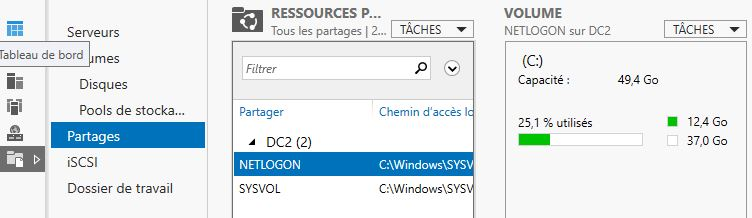

En cliquant sur `Tâches`, on va créer un nouveau partage de type `Partage SMB - Rapide`

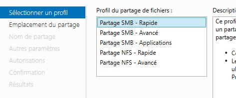

On choisi le disque de stockage pour le partage

En tant normal, il est préférable de séparer le rôle de serveur de fichier, du rôle contrôleur de domaine et, mettre le partage sur un disque autre que le disque C:

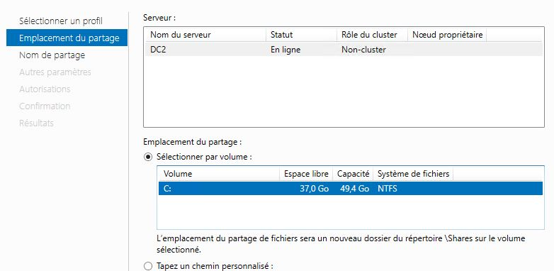

On donne un nom au partage, qui en même temps, créera le dossier à l'emplacement donné si il n'existe pas déja

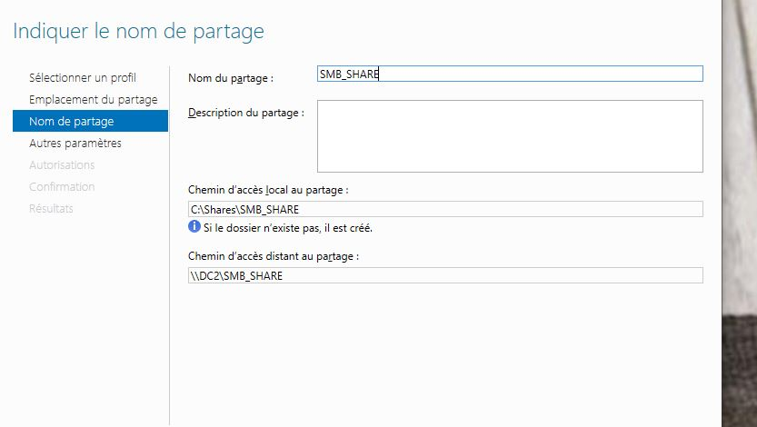

Ici, j'active l'énumération, qui permet de filtrer ce que chaque utilisateurs peut voir ou non, selon les droits d'accès qui lui est attribué

J'active aussi le chiffrement de l'accès aux données, pour ajouter une couche de sécurité en plus.

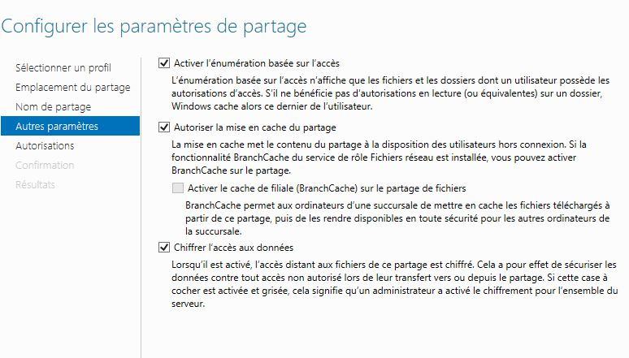

Au niveau des autorisations, les utilisateurs authentifiés devront seulement avoir la possibilité de lister les fichiers et dossiers à la racine du partage et d'accéder en lecture seul à ces derniers.

Mais par défaut, les utilisateurs possédent aussi des droits spéciaux.

Ici, je décide de désactiver l'héritage des droits et de supprimer la ligne `autorisation spéciale` pour les utilisateurs. Ainsi, les utilisateurs ne peuvent pas créer de fichiers ou dossiers en racines du partage

A ce niveau ci, libre à l'administrateur de créer des dossiers par secteur et attribué les droits de lecture/écriture en fonction de la politique de l'entreprise, chose que je n'ai pas mis en place.

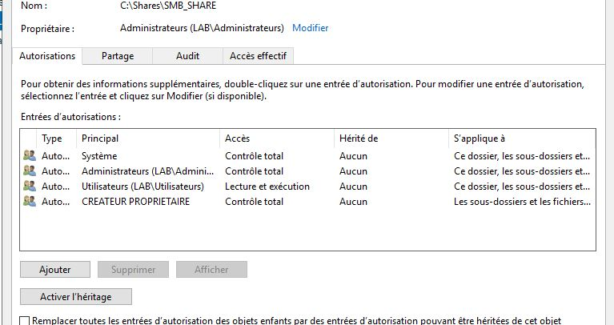

Récapitulatif de la configuration, on valide et on crée le partage

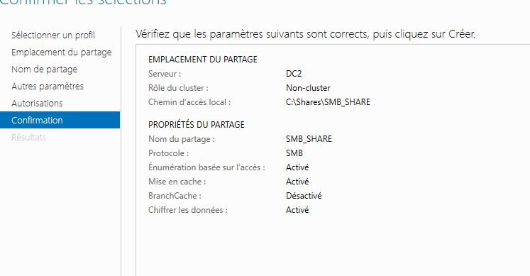

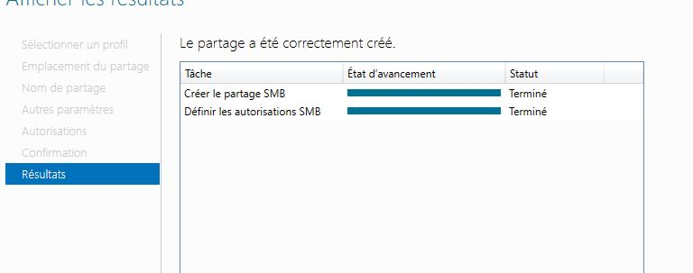

On peut voir que le partage SMB est bien crée, avec le nom et le chemin d'accès visible

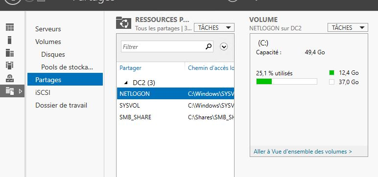

***

### Mappage lecteur

Pour faire en sorte le partage SMB soit disponible pour tout les utilisateurs authentifiés, il faut créer une GPO, que j'ai lié au niveau domaine

Normalement, l'organisation des OU permet de gérer efficacement, de manière logique, structurel et hiérarchisé comment les GPO doivent être paramètré pour affecté les ressources cible

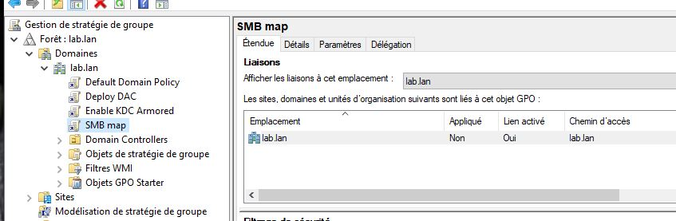

La GPO pour mapper un partage en tant que lecteur réseau se situe

`Configuration utilisateur -> préférences -> paramètres windows -> Mappage de lecteurs`

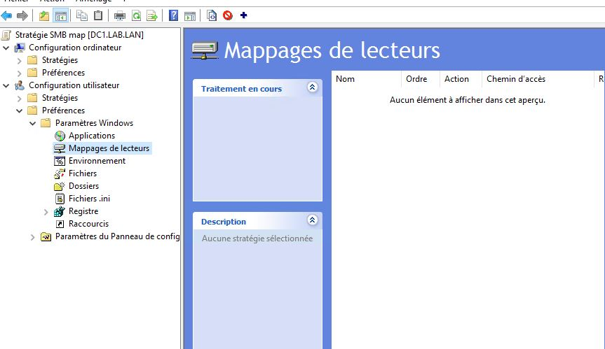

Pour ajouter un lecteur réseau, clique droit et nouveau lecteur réseau

Pour les options:

- Action : Créer -> créer un nouveau lecteur réseau
- Emplacement : Chemin UNC du partage SMB à mapper
- Libeller : Nom d'affichage du lecteur réseau

On peut valider les réglages

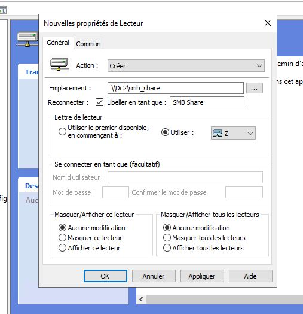

On peut voir que, le mappage du partage en tant que lecteur réseau apparait bien dans la liste

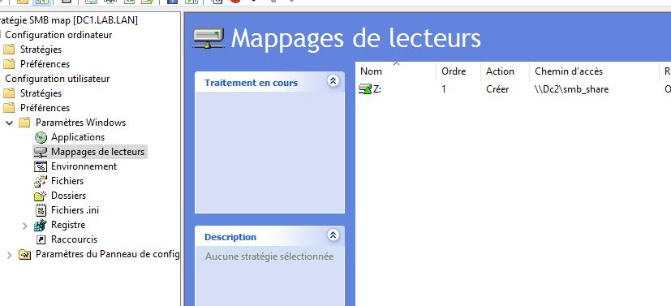

sur le DC1 en powershell avec la commande `get-smbmapping` après avoir fait un `gpupdate /force`

Le mappage réseau apparait bien

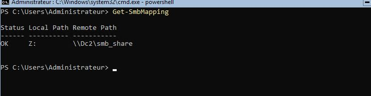

***

### Contrôle

Pour vérifier que le lecteur réseau soit bien monté au démarrage de la session.

En me connectant avec une session utilisateur du domaine

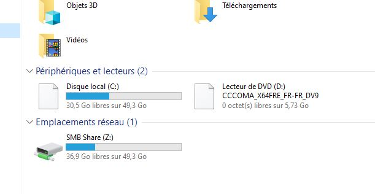

## 🧠 Ce que j’ai appris

- Le mappage réseau d'un partage permet de se simplifier le travail en automatisant le processus via une GPO au lieu de le faire à la main
- L'importance de la segmentation des ressources ( groupes,utilisateurs,machines etc...) permet de gérer plus efficacement et au cas par cas les règles par type de ressources.
