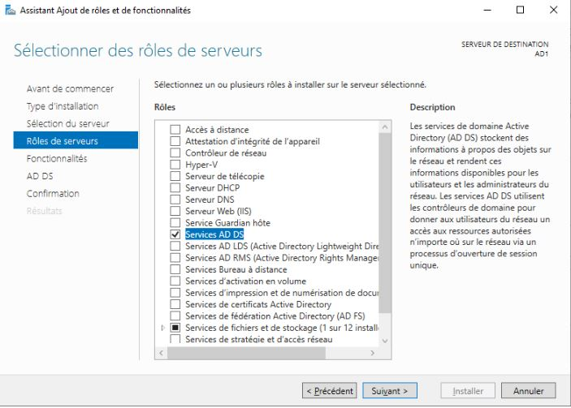
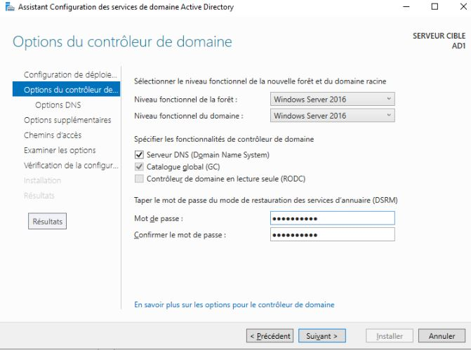
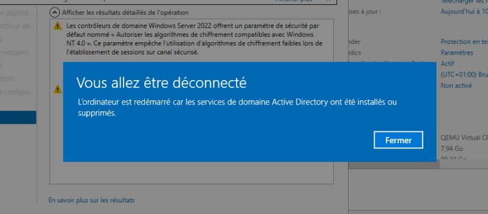

# 💻 Lab personnel - Administration Système

## 📌 Objectifs du lab

- Mise en place d'un domaine active directory

## 🛠️ Environnement technique

- **OS** : windows Server 2022
- **Hyperviseur** : Proxmox

## 🗂️ Modules détaillé

|📁 Module|Description|
|:-:|:-|
|Installation|Installation de rôle ADDS|
|Création|Création d'une fôret et d'un domaine active directory|
|Connexion|Connexion en tant que administrateur du domaine|

## 📸 Etapes mise en place de la solution

Le premier serveur qui servira de contrôleur de domaine doit être configuré:

- Nommer le serveur avec un nom plus commun
- Appliquer une IP statique

Pour l'instant, le serveur est en mode `WORKGROUP`

S'ensuit l'installation du rôle ADDS

Comme je ne possède ni domaine existant, ni forêt existante, je crée une nouvelle forêt et un nouveau domaine que je vais nommer `lab.local`

Définition d'un mot de passe DSRM

J'ai choisis de ne pas créer de délégation DNS pour pouvoir la gérer manuellement plus tard

Contrôle de la configuration avant d'installer le rôle ADDS

Lors de la fin de l'installation, un reboot est nécessaire

Une fois redémarrer, on peut se connecter en tant que administrateur du domaine

## 🧠 Ce que j’ai appris

- Création d'une fôret et d'un domaine active directory
- Comment mettre en place un serveur qui fait office de contrôleur de domaine
