# 🖧 💻 Lab personnel - Administration Système

## 📌 Objectifs du lab

- Mise en place d'un DHCP pour un lan unique sans options
- Création de réservation DHCP
- Mise en place d'un Fail-over pour assurer une disponibilitée

## 🛠️ Environnement technique

- **OS** : Windows server 2022 / Windows 10 pro
- **Hyperviseur** : Proxmox

## 🗂️ Modules détaillés

|📁 Module|Description|
|:-:|:-:|
|Installation du rôle|Installation et configuration du DHCP|
|Création pool|Mise en place du pool HDCP pour le lan|
|Configuration Failover|Configuration de la solution Fail-over sur un deuxième serveur|

## 📸 Etapes mise en place de la solution

### Installation du rôle

Sur le serveur AD1, installation du rôle DHCP

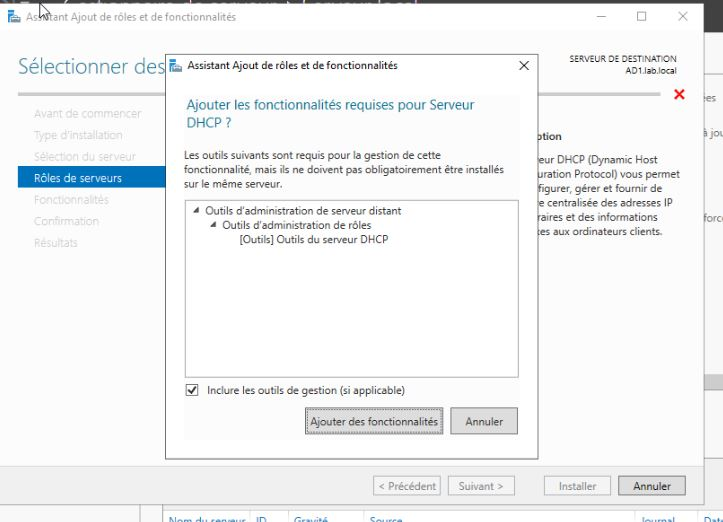

### Création Pool DHCP

Création de l'étendu avec un nom et une description qui doit rester facilement compréhensible.

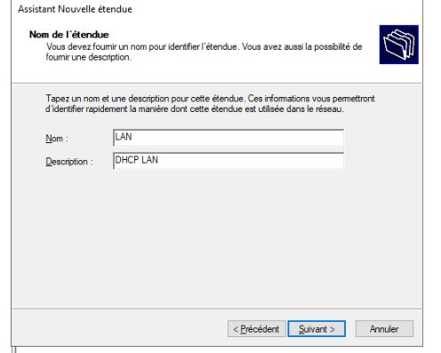

Configuration de la plage IP avec le masque réseau

J'ai choisis volontairement une plage qui permet d'exclure automatiquement, autant les serveurs que la passerelle par défaut pour éviter des potentiels conflits

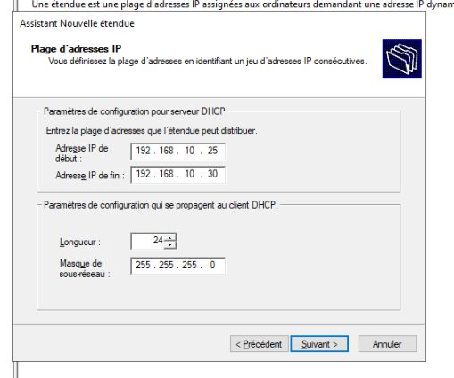

Exclusion d'adresse IP qui fait parti du pool créer précédement

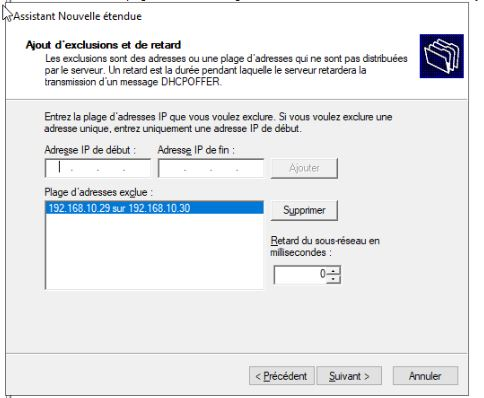

Pas de modification de la durée du bail.

Dans mon environnement de lab je n'en ai pas d'intéret.

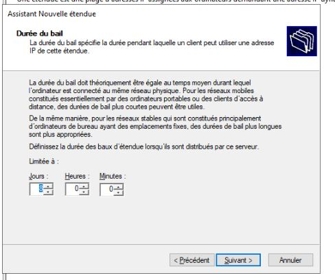

Ajout de la passerelle par défaut distribuer aux hôtes

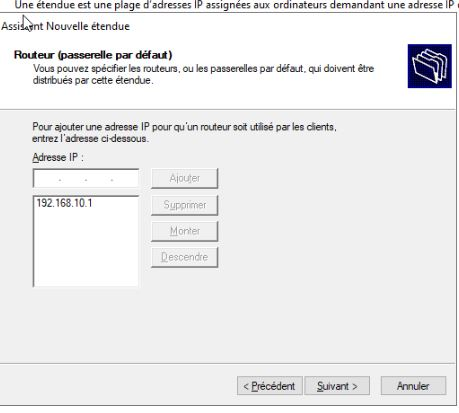

Ajout d'un serveur DNS, ici mon serveur AD1, je n'ai pas ajouté l'AD2 en tant que DNS

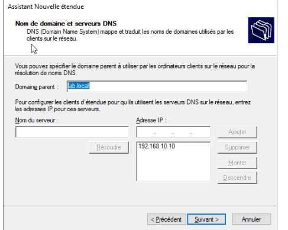

J'ai laissé la configuration par défaut du/des serveur(s) WINS par défaut.

Je n'ai jamais apprs à utiliser les serveurs WINS, au vu de la vieillesse de cette technologie

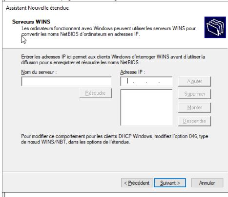

Une fois finie, on active l'étendue.

Il peut être possible, que l'on doit autoriser le services DHCP sur le domaine

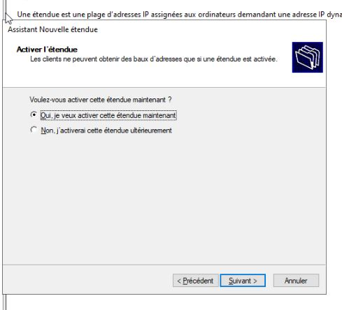

Dans la console DHCP, on retrouve bien l'étendue créer avec le pool d'adresse autoriser à être distribuer ainsi que, la plage d'adresse exclue du pool

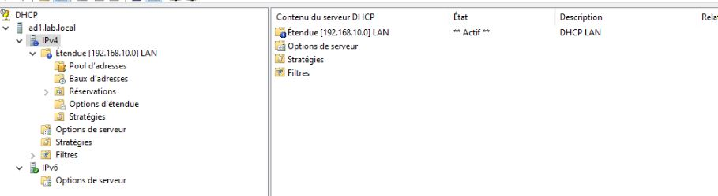

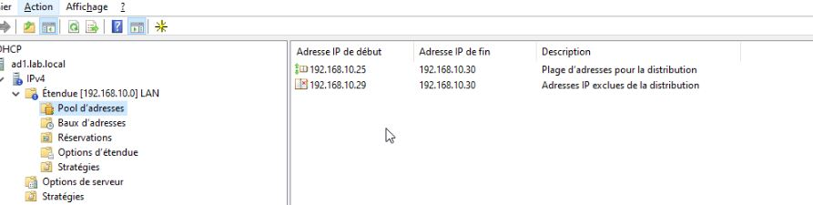

Ajout d'une réservation DHCP pour le serveur AD2

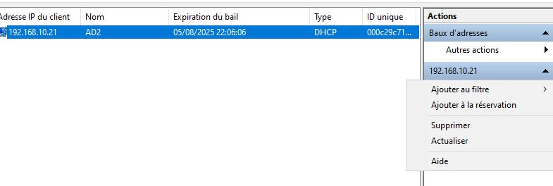

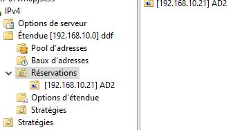

### Configuration Fail-over

Sur l'AD1, après avoir fait un click droit et choisis: configurer un basculement, une fenêtre de configuration s'ouvre

Je choisis l'étendue à configurer, ici j'en ai une seule

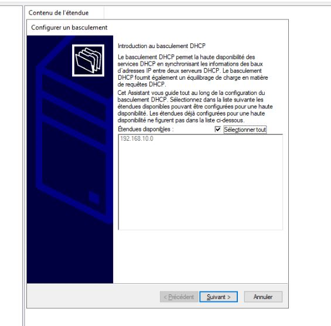

Je dois ensuite choisir le serveur DHCP "partenaire",qui est AD2

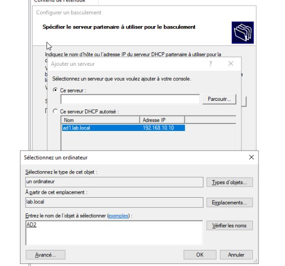

Je lui défini que les 2 serveurs DHCP devront fonctionner en équilibrage de charge avec un ratio de charge équivalent à 50/50

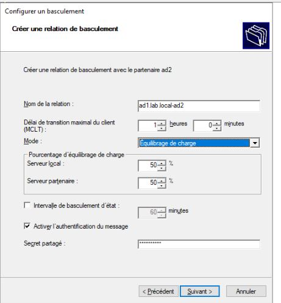

Un petit récap' de la configuration avant la validation

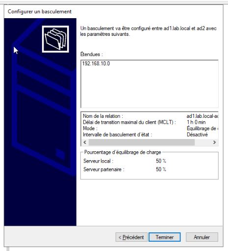

Ici, sur l'AD2, on peut constater que l'étendue DHCP est bien remonter et le serveur DHCP disponible.

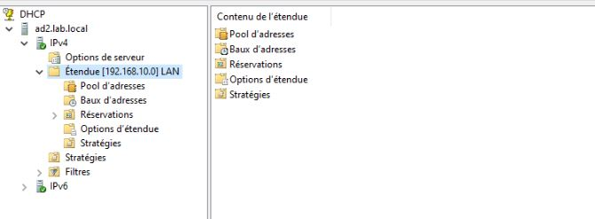

## 🧠 Ce que j’ai appris

- Installation et configuration du rôle DHCP
- Mise en place d'une étendue et des exclusions
- Création d'un basculement pour permettre une redondance du service DHCP en cas de panne
- Assurer une disponibilité accrue en faisant un doublon du service
