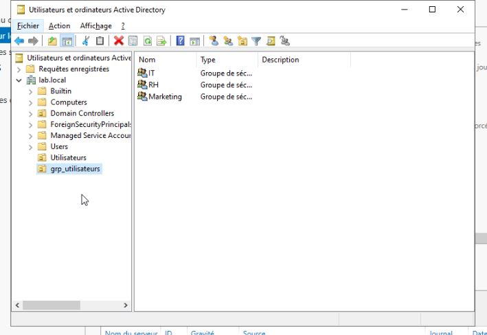
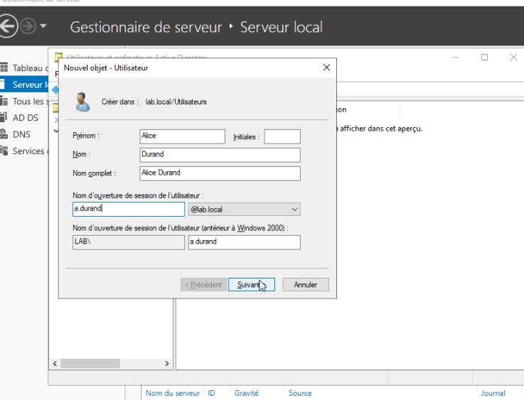

# 💻 Lab personnel - Administration Système

## 📌 Objectifs du lab

- Création de groupes et d'utilisateurs
- Organisation des ressources en unitées d'organisation

## 🛠️ Environnement technique

- **OS** : Windows Server 2022
- **Hyperviseur** : Proxmox

## 🗂️ Modules détaillé

|📁 Modules|Détail|
|:-:|:-:|
|Unitée d'organisation|Création d'unitées d'organisation|
|Groupes et utilisateurs|Création d'utilisateurs et groupes|
|Contrôle|Vérification de la création des ressources|

## 📸 Etapes mise en place de la solution

Dans la console `utilisateurs et ordinateurs active directory`, je crée 2 nouvelles unitée d'organisation:

- Utilisateurs : Permet de regrouper tout les utilisateurs créer
- grp_utilisateurs : Permet de regrouper tout les groupes créer

Dans mon unitée d'organisation `grp_utilisateurs`, je vais créer des groupes de sécurité pour pouvoir attribuer des groupes aux utilisateurs

Dans mon unitée d'organisation `utilisateurs`, je vais créer quelques utilisateurs

On retrouve les 3 utilisateurs créer

## 🧠 Ce que j’ai appris

- Création basique d'utilisateurs et groupes
- Importance de créer des unitées d'organisation pour gérer plus efficacement les ressources
