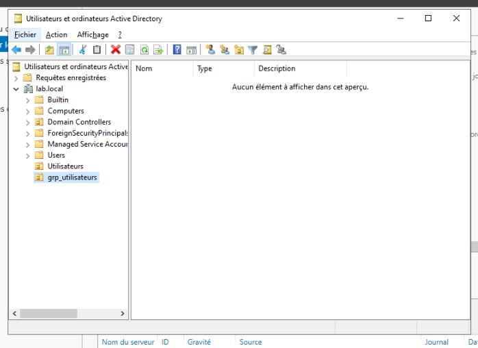
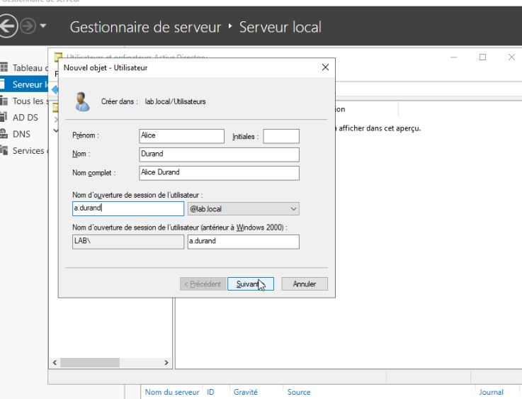

# Creation Unitées d'organisation

## Sujet du lab

Création d'unitées d'organisation dans le but de gérer plus efficacement les groupes, utilisateurs, pc présent dans l'active directory et dans le futur, mettre en place une gestion des droits via la méthode AGDLP

## Etapes de mise en place de la solution

Dans la console `utilisateurs et ordinateurs active directory`, je crée 2 nouvelles unitée d'organisation:

- Utilisateurs : Permettera de regrouper tout les utilisateurs créer
- grp_utilisateurs : Permettera de regrouper tout les groupes créer

Dans mon unitée d'organisation grp_utilisateurs, je vais créer des groupes de sécurité pour pouvoir attribuer des groupes à mes utilisateurs

Dans mon unité d'organisation utilisateurs, je vais créer quelques utilisateurs

On retrouve nos utilisateurs créer

