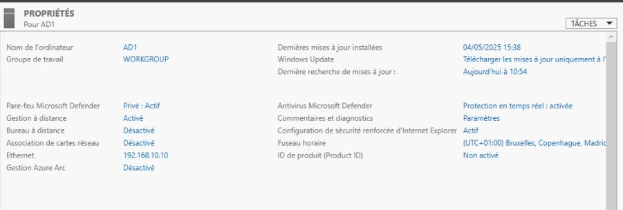
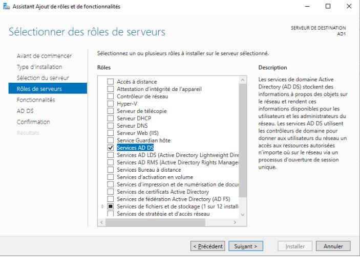
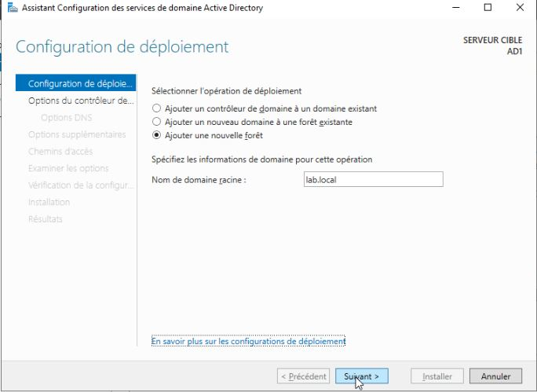
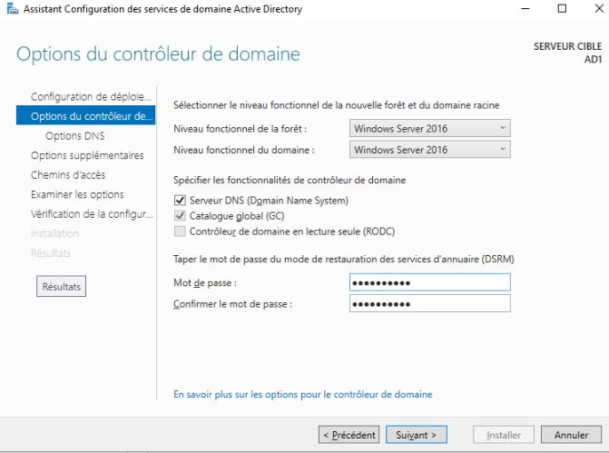
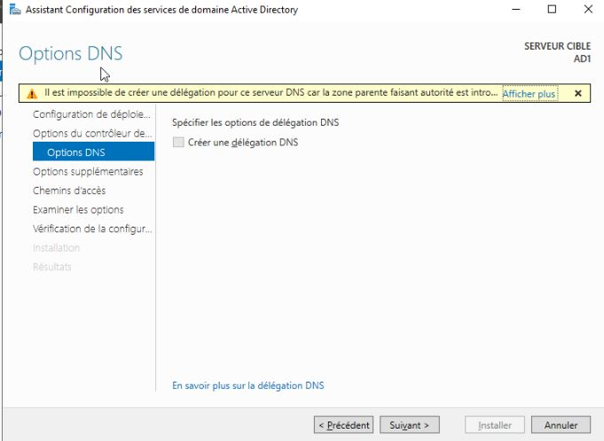
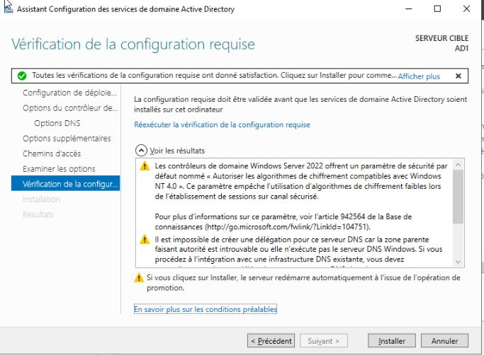
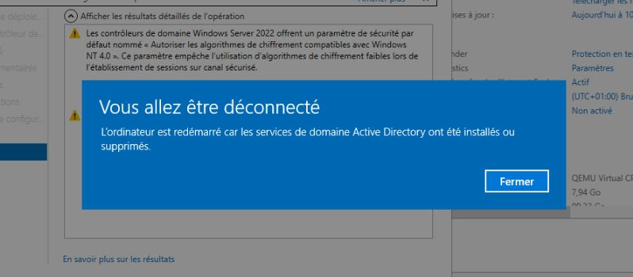
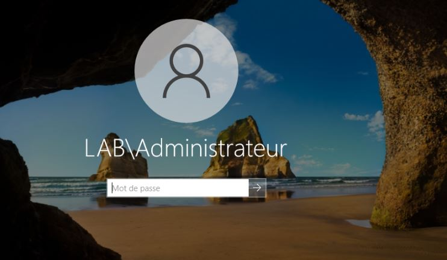

# Creation d'un domaine active directory

## Sujet du lab

Dans ce lab, le 

Le premier serveur qui servira de contrôleur de domaine est configuré:

- Renommer
- IP Statique

Pour l'instant, le serveur est en mode `WORKGROUP`

S'ensuit l'installation du rôle ADDS

Comme je ne possède ni domaine existant, ni forêt existante, je crée une nouvelle forêt que je nomme `lab.local`

Définition du mot de passe DSRM

Je choisis de ne pas créer de délégation DNS pour pouvoir la gérer manuellement plus tard

Contrôle de la configuration avant d'installer le rôle ADDS

Lors de la fin de l'installation, un reboot est nécessaire

Une fois redémarrer, ont peux se connecter en tant que administrateur du domaine

