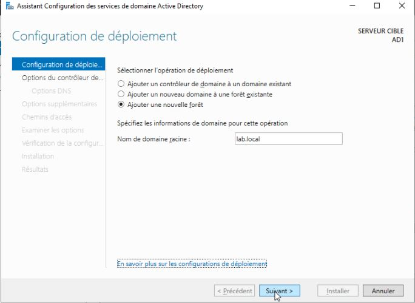
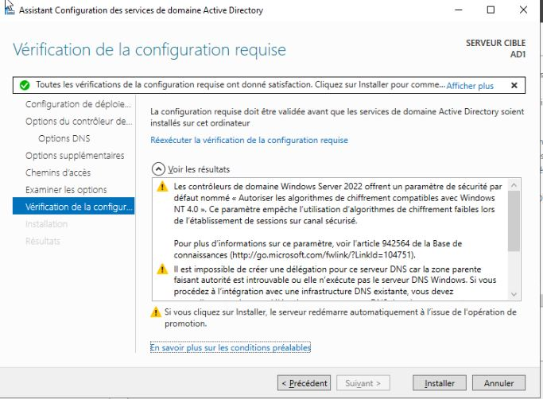

# 🖧 Lab personnel - Administration Système & Réseau

Bienvenue sur mon lab personnel dédié à l’administration système et réseau. Ce projet me permet d’explorer, tester et documenter différents services et configurations en environnement virtualisé.

## 📌 Objectifs du lab

Mise en place d'un domaine active directory

## 🛠️ Environnement technique

- **OS** : windows Server 2022
- **Hyperviseur** : Proxmox
- **Outils** : Aucun
- **Topologie réseau** : Aucun

## 🗂️ Module détaillés

|📁 Module|Description|
|:-:|:-:|
|ADDS|Gestion centralisée des identités et ressources.|

## 📸 Etapes mise en place de la solution

Le premier serveur qui servira de contrôleur de domaine est configuré:

- Renommer
- IP Statique

Pour l'instant, le serveur est en mode `WORKGROUP`

S'ensuit l'installation du rôle ADDS

Comme je ne possède ni domaine existant, ni forêt existante, je crée une nouvelle forêt et un nouveau domaine que je vais nommer `lab.local`

Définition d'un mot de passe DSRM

J'ai choisis de ne pas créer de délégation DNS pour pouvoir la gérer manuellement au fil du temps

Contrôle de la configuration avant d'installer le rôle ADDS

Lors de la fin de l'installation, un reboot est nécessaire

Une fois redémarrer, on peut se connecter en tant que administrateur du domaine

## 🧠 Ce que j’ai appris
